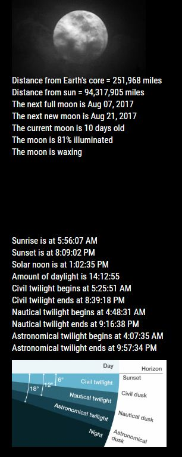
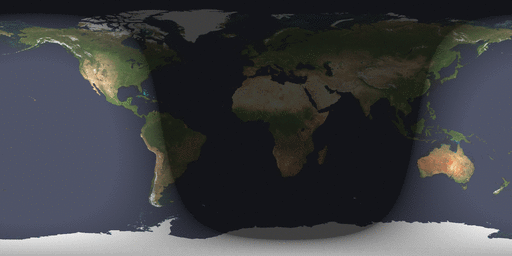
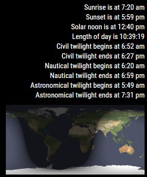
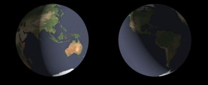

## MMM-SunRiseSet

More information than you ever wanted to know about the rising and setting of the sun.

## The information 

* Sunrise: The actual time the rising sun breaches the horizon.
* Sunset: The actual time the sun falls completely below the horizon.
* Solar Noon: The actual time when the sun is at its highest altitude in the sky.
* Day Length: The length of time between sunrise and sunset.
* Civil Twilight: The geometric center of the Sun is at most 6 degrees below the horizon.
* Nautical Twilight: The geometric center of the Sun is between 6 and 12 degrees below the horizon.
* Astronomical Twilight: The geometric center of the Sun is between 12 and 18 degrees below the horizon.

## Examples with static graph

* MMM-Lunartic in top_left region

* MMM-SunRiseSet in bottom_left region

## Example animation instead of static graph

, 
* Obviously, day or night will move much more slowly

## Or animated earth image
* Updates to show daylight approaching or night approaching

* Config option to show just animated world or map without the data

Annotated .css file included for aligning and coloring text. 
css file also used to display as little or as much data as you like.

## Installation

* `git clone https://github.com/mykle1/MMM-SunRiseSet` into the `~/MagicMirror/modules` directory.

* No API key needed! No dependencies needed! No kidding!

## Config.js entry and options

    {
		disabled: false,
		module: "MMM-SunRiseSet",
		position: "bottom_left",
		config: {
			lat: "41.111111",      // Your latitude (for the data)
			lng: "-75.111111",     // Your longitude (for the data)
			image: "map",        // "world" (animation), "map" (animation), "static" (graph)
			imageOnly: "yes",       // no = all data, yes = only animated world or map
			dayOrNight: "night",   // "night" approaching, "day" approaching (imageOnly: must be "yes", image: must be "world") 
			useHeader: false,      // true if you want a header
			header: "Header",      // useHeader must be true
			maxWidth: "400px",
        }
    },
	

## Thanks go to SpaceCowboysDude for UTC and moment advice
## Thanks also to Sean and Strawberry for updateDOM guidance
